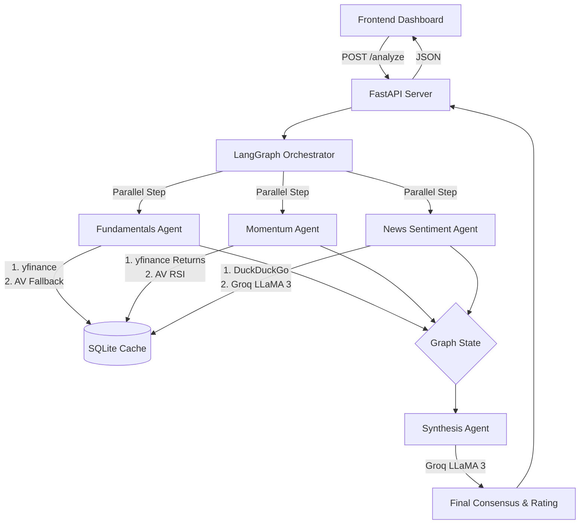

# Fin-Vantage Scout: Multi-Agent Equity Screener


## Description

Fin-Vantage Scout is a highly structured, multi-agent financial screening system. It orchestrates parallel AI and data-fetching agents to analyze equities through fundamental data extraction, peer-relative momentum ranking, and LLM-driven news sentiment analysis. Built with LangGraph and FastAPI, the system integrates local caching, API fallbacks, and cloud/local LLM inference to synthesize structured equity consensus ratings.

## Why

Traditional financial screeners rely on rigid rules and lack qualitative context, while raw LLMs hallucinate numbers and struggle with live data. Fin-Vantage Scout bridges this gap by enforcing a **"data-first, LLM-second"** architecture. It hardcodes the mathematical and fundamental data gathering step, passing perfectly structured context to an LLM strictly for qualitative synthesis and sentiment analysis. 

## What's New

- **Alpha Vantage Integration (Fallback & Technicals):** Integrated Alpha Vantage REST API to serve as a robust fallback for missing fundamental data from Yahoo Finance, and to provide native 14-day RSI (Relative Strength Index) technical signals.
- **Quota Safety Constraints:** Added API key limit constraints to prevent accidental throttling of free-tier data sources.
- **Enhanced Frontend Dashboard:** Revamped Vanilla JS/CSS frontend replacing the legacy Streamlit UI. Features a dark/light mode toggle, dynamic pipeline flow diagrams, and structured momentum visualizations.
- **Dynamic Company Mapping:** Automatic company name extraction across API fetches, reducing reliance on hardcoded ticker maps.

## Stock Selection Modes

1. **Manual Entry:** Input specific comma-separated tickers (e.g., `NVDA, MSFT, AAPL`) to run targeted analysis.
2. **Auto (FFTY Screen):** Automatically scrapes the top holdings from the Innovator IBD 50 ETF (FFTY) to dynamically populate the screener with high-momentum, market-leading growth stocks.

## File Structure

```text
fin-vantage-scout/
├── backend/
│   ├── agents/
│   │   ├── step1a_fundamentals_agent.py   # Extracts core balance sheet / margin data
│   │   ├── step1b_momentum_agent.py       # Calculates relative return percentiles & RSI
│   │   ├── step2_news_agent.py            # DuckDuckGo headline scraper & LLM sentiment extractor
│   │   └── step3_synthesis_agent.py       # Synthesizes inputs into a final rating
│   ├── data/
│   │   ├── alpha_vantage.py               # REST client for Alpha Vantage (Overview, RSI)
│   │   └── market_data.py                 # SQLite-backed yfinance API wrapper
│   └── app.py                             # FastAPI server & LangGraph orchestration
├── frontend/
│   ├── static/
│   │   ├── app.js                         # Frontend logic, API polling, and DOM rendering
│   │   └── style.css                      # Custom CSS design system
│   └── templates/
│       └── index.html                     # Main dashboard layout
├── config.py                              # Environment variables and configuration
├── requirements.txt                       # Project dependencies
└── README.md                              # This documentation
```

## Detailed Tech Stack Table

| Component | Technology | Purpose |
|---|---|---|
| **Language** | Python 3.11 | Core backend execution and scripting. |
| **Framework** | FastAPI | High-performance async web server providing REST endpoints. |
| **Agent Orchestration** | LangGraph | State-machine graph logic to parallelize agents and enforce workflow structure. |
| **LLM Inference** | LLaMA 3 (via Groq/Ollama) | Fast, cheap LLM for qualitative sentiment parsing and final synthesis. |
| **Market Data (Primary)** | `yfinance` | Primary source for price history, financials, and peer-universe tracking. |
| **Market Data (Secondary)** | Alpha Vantage | Fallback for missing fundamentals and source for 14-day RSI technicals. |
| **News Data** | `duckduckgo_search` | Headless scraping of recent financial headlines. |
| **Caching** | SQLite | Local disk caching with TTL to prevent rate-limiting from data providers. |
| **Frontend** | Vanilla JS / HTML / CSS | Lightweight, custom dashboard without heavy React/Vue build steps. |

## Detailed Architecture Diagram



## Technical Explanation of Each Agent and Supporting File

### 1. `step1a_fundamentals_agent.py`
- **Role:** Extracts exact mathematical ratios (Current Ratio, Debt-to-Equity, ROE, Gross Margin).
- **Mechanism:** Queries `yfinance` first. If any critical value is `None`, it gracefully falls back to the Alpha Vantage `OVERVIEW` endpoint.
- **Output:** `FundamentalsResult` (Pydantic model containing exact floats and data availability flags).

### 2. `step1b_momentum_agent.py`
- **Role:** Calculates relative strength and technical indicators.
- **Mechanism:** Fetches 6-month and 12-month trailing returns for the target ticker *and* a proxy peer universe (FFTY ETF). Calculates a percentile rank (0-100) indicating how the stock compares to peers. Also fetches 14-day RSI via Alpha Vantage.
- **Output:** `MomentumResult` (Pydantic model with percentiles, raw returns, and RSI).

### 3. `step2_news_agent.py`
- **Role:** Analyzes recent market sentiment.
- **Mechanism:** Scrapes the latest 10 headlines using `duckduckgo_search`. Wraps these headlines in a strict prompt and sends them to LLaMA 3 to classify overall sentiment (Positive, Neutral, Negative) and generate a 1-sentence summary.
- **Output:** `NewsResult` (Pydantic model with sentiment enum and summary).

### 4. `step3_synthesis_agent.py`
- **Role:** Final decision maker.
- **Mechanism:** Receives the fully structured `FundamentalsResult`, `MomentumResult`, and `NewsResult`. Feeds them into LLaMA 3, instructing it to act as a senior equity analyst. It forces the LLM to output a strict JSON schema containing an investment rating (Attractive, Neutral, Caution) and 3 bullet points.
- **Output:** `SynthesisResult` (Pydantic model representing the final verdict).

### Supporting Files
- **`app.py`:** Initializes the FastAPI app. Defines the `StateGraph` linking the agents. Includes dependency injection for configuration and enforces API rate limits (e.g., 10-ticker cap for Alpha Vantage).
- **`data/market_data.py` & `data/alpha_vantage.py`:** Contains the physical HTTP/REST requests and `yfinance` SDK calls. Crucially implements SQLite caching (`backend_cache.db`) using an expiration TTL to ensure consecutive runs do not trigger rate limits.

## System Workflow & Execution Steps

1. **Request Reception:** User triggers `/analyze` via the frontend with a payload of tickers.
2. **Quota Check:** The system verifies if the requested ticker count exceeds the safe Alpha Vantage daily limit to prevent blocking.
3. **Graph Initialization:** LangGraph generates an empty state dictionary for a specific ticker.
4. **Parallel Execution:** Step 1a, 1b, and 2 are executed simultaneously using Python's asyncio context.
5. **Caching:** All external API calls immediately check the local SQLite db. If a fresh cache exists, it returns in milliseconds; otherwise, it hits the network and saves the result.
6. **Synthesis:** Once parallel nodes complete, the graph transitions to the Synthesis node.
7. **Response:** The populated graph state is serialized into JSON and sent back to the frontend.
8. **UI Rendering:** The Vanilla JS frontend parses the structured JSON and dynamically builds the Stock Cards and Infographics.

## Setup Instructions

### Prerequisites
- Python 3.11+
- `uv` package manager (recommended) or `pip`

### 1. Clone & Install
```bash
git clone https://github.com/jayantsom/fin-vantage-scout.git
cd fin-vantage-scout
uv venv
source .venv/bin/activate  # (Windows: .venv\Scripts\activate)
uv pip install -r requirements.txt
```

### 2. Configure Environment
Create a `.env` file in the root directory (refer to `.env.example`):
```env
# Required for News and Synthesis Agent (Free Tier Available)
GROQ_API_KEY="gsk_..."

# Optional but Highly Recommended for Fallbacks & RSI (Free Tier Available)
ALPHA_VANTAGE_API_KEY="your_alpha_vantage_key"

# Uses cloud Groq API by default
LLM_PROVIDER="groq" 
```

### 3. Run the Server
```bash
uv run uvicorn backend.app:app --host 127.0.0.1 --port 8000 --reload
```
Access the dashboard at `http://127.0.0.1:8000`.

## Validations

- **Pydantic Validation:** All agent outputs are strictly typed. If LLaMA 3 hallucinates a JSON key, LangChain's structured output parser throws a validation error and retries.
- **Fallback Integrity:** If Alpha Vantage hits its 25-call daily limit, the system degrades gracefully, marking the RSI as `None` without crashing the graph.
- **Cache Hits:** The SQLite cache actively reduces API latency by ~90% on subsequent runs for the same ticker.

## Future Scope

While the current implementation is stable, future enhancements may include:
- **Valuation Agent:** Comparing EV/EBITDA and Forward P/E against historical medians.
- **Earnings Call Parsing:** Using RAG to extract qualitative forward guidance from SEC 10-Q filings and earnings transcripts.
- **Portfolio Weighting:** Expanding from single-stock screening to automated portfolio optimization recommendations.

## License & Intended Use

**MIT License**
This software is provided for educational and research purposes only. It does not constitute financial advice. The developers are not liable for any financial losses incurred from using this tool.

## Author & Contact

**Jayant Som**
- **LinkedIn:** [https://www.linkedin.com/in/jayantsom](https://www.linkedin.com/in/jayantsom)
- **Email:** [jayant4195@gmail.com](mailto:jayant4195@gmail.com)
