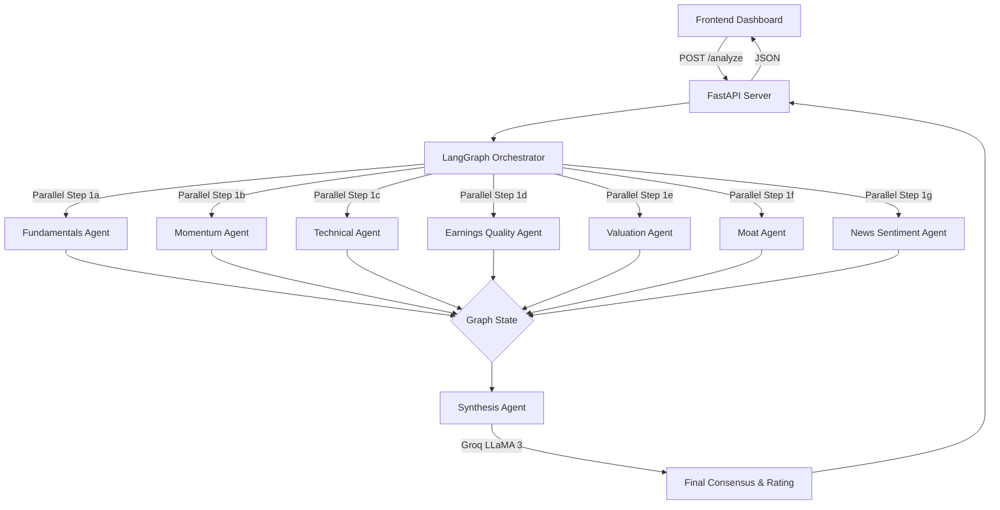

# Fin-Vantage Scout: Multi-Agent Equity Screener


## TL;DR

**Fin-Vantage Scout** is a Python-based, multi-agent AI system (LangGraph + FastAPI) that automatically screens stocks. It uses deterministic APIs (yfinance, Alpha Vantage) to fetch raw financial data and momentum metrics, then passes this hard data to an LLM (LLaMA 3) to generate accurate, hallucination-free investment summaries and ratings.

## Description

When you enter a list of stock tickers (or run in Auto mode), Fin-Vantage Scout performs a structured analysis of each stock step-by-step:

1. **Information Gathering (Parallel Agents):** The system triggers seven independent analysis specialists in parallel:
   - **Fundamentals:** Collects core balance sheet health (Current Ratio, Debt-to-Equity) and profitability metrics (ROE, Gross Margin, and quarterly growth rates).
   - **Momentum:** Evaluates price performance over the last 6 and 12 months, calculating how the stock ranks compared to its peers, along with speed/momentum indicators.
   - **Technicals:** Examines volume spikes relative to historical averages, price drawdown from yearly highs, volatility, and trading accumulation trends.
   - **Earnings Quality:** Assesses the cash backing behind reported earnings, validating if profits are real cash flows or just accounting accruals.
   - **Valuation:** Measures standard pricing multiples (P/E, P/S, EV/EBITDA) against median valuation levels of same-sector peers in the analysis batch.
   - **Moat Durability:** Computes consistency and stability of profit margins, return on capital, and sales growth over several years.
   - **News Sentiment:** Scrapes the latest financial headlines and uses a fast language classifier to assess news sentiment.
2. **Deterministic Composite Scoring:** Before involving any reasoning models, the system mathematically calculates a composite score (1–99) representing the quantitative strength of the stock based on its momentum, earnings growth, and gross margins.
3. **AI Synthesis & Recommendation:** The qualitative and quantitative results from all 7 specialists are packaged and passed to a senior AI Analyst. This analyst verifies the inputs, writes a concise synthesis summary, assigns a final rating (Attractive, Neutral, or Caution), and comments on key aspects.
4. **Interactive Visualization:** The web dashboard updates dynamically, showing full-width stock cards, visual indicators for volume-momentum confirmation, interactive technical charts (price/volume, margins, peer valuation), and expandable detailed data sheets.

---

## Why

Traditional financial screeners rely on rigid rules and lack qualitative context, while raw LLMs hallucinate numbers and struggle with live data. Fin-Vantage Scout bridges this gap by enforcing a **"data-first, LLM-second"** architecture. It hardcodes the mathematical and fundamental data gathering step, passing perfectly structured context to an LLM strictly for qualitative synthesis and sentiment analysis. 

---

## What's New (Phase 3 & Phase 4 Updates)

- **Sequential Pipeline Reordering (News shifted to 1g):** Reordered the multi-agent graph so that *News Sentiment* acts as the final qualitative "soft signal" (Step 1g) in the parallel fan-out, fanning into Step 2 (Synthesis) alongside the 6 quantitative data specialists.
- **ApexCharts-Powered Peer Comparison & Technical Charts:** Replaced legacy visualizations with fully responsive, interactive interactive charts in the UI. Users can dropdown-switch between Price/Volume, Momentum Percentiles, Margin & ROIC Trends, and Batch-scoped Peer Valuations.
- **Advanced Quantitative Metrics (Sloan Accruals & Moat CoV):** Integrated Sloan Accruals (earnings quality) and Coefficient of Variation (CoV) calculations for Moat Durability.
- **Deterministic 1–99 Composite Score:** Implemented a non-LLM, deterministic grading system combining Momentum, EPS growth, and Gross Margins.
- **Improved UI Layout with Integrated Summaries:** Redesigned the stock cards to feature the AI Synthesis summary prominently at the top, followed by quick reference tiles, and collapsible detailed metric sheets.
- **Favicon & Cache Buster Integrations:** Silenced browser 404s for favicon resources and implemented query-string cache-busters (`?v=3`) to ensure instant frontend deliveries of fresh stylesheets and JS updates.

---

## Stock Selection Modes

1. **Manual Ticker Entry:** Input specific comma-separated tickers (e.g., `NVDA, MSFT, AAPL`) to run targeted analysis.
2. **Auto (FFTY Screen):** Scrapes the Innovator IBD 50 ETF (FFTY) holdings to dynamically extract and analyze top-tier momentum and growth stocks.

---

## Methodologies & Formulas

Before exploring each section, refer to the table below for abbreviations of terms and indicators used throughout our analysis:

### Abbreviation Table

| Abbreviation | Full Term | Description |
| :--- | :--- | :--- |
| **API** | Application Programming Interface | Data fetched directly from external providers (yfinance or Alpha Vantage). |
| **YoY** | Year-over-Year | Comparison of a metric for one period against the same period in the previous year. |
| **EPS** | Earnings Per Share | A company's net profit divided by the number of common shares outstanding. |
| **RSI** | Relative Strength Index | A momentum oscillator that measures the speed and change of price movements. |
| **ATR** | Average True Range | A technical analysis indicator that measures market volatility. |
| **Acc/Dis** | Accumulation/Distribution | A volume-based indicator designed to measure cumulative flow of money into and out of a security. |
| **CoV** | Coefficient of Variation | A statistical measure of the dispersion of data points around the mean (Standard Deviation / Mean). |
| **OCF** | Operating Cash Flow | The amount of cash generated by a company's normal business operations. |
| **P/E** | Price-to-Earnings Ratio | Market value per share divided by earnings per share. |
| **P/S** | Price-to-Sales Ratio | Market capitalization divided by total revenues. |
| **EV** | Enterprise Value | A measure of a company's total value (Market Cap + Debt - Cash). |
| **EBITDA** | Earnings Before Interest, Taxes, Depreciation, and Amortization | A measure of a company's overall financial performance. |
| **ROIC** | Return on Invested Capital | A calculation used to assess a company's efficiency at allocating capital to profitable investments. |
| **LLM** | Large Language Model | Artificial intelligence model used for synthesis and news sentiment analysis. |

---

### 1A. FUNDAMENTAL

Fundamental analysis is the process of examining a company's financial statements, operational performance, and balance sheet strength to determine its intrinsic value and long-term viability. By analyzing growth rates, liquidity, leverage, and capital efficiency, investors can determine if a stock's underlying business is healthy, expanding, and capable of generating sustainable shareholder returns. In this platform, fundamental metrics serve as the primary filter to ensure we screen for fundamentally strong companies before technical or news catalysts are analyzed.

#### Current Ratio
- **Definition**: A liquidity ratio that measures a company's ability to cover its short-term obligations (due within one year) with its short-term assets.
- **Why/How it is used**: It shows whether a company has sufficient cash, receivables, and inventory to pay its current liabilities. A ratio above 1.5 is generally preferred to ensure solvency.
- **Formula**: Coming directly from API (yfinance/Alpha Vantage).
- **One Solved Example (Sample Stock XYZ)**:
  - Current Assets = $34.2B
  - Current Liabilities = $10.0B
  - Current Ratio = `3.42` (XYZ has ample short-term liquidity, holding $3.42 of current assets for every $1.00 of current liabilities).

#### Debt-to-Equity
- **Definition**: A leverage ratio that evaluates the proportion of debt financing relative to equity financing used by the company.
- **Why/How it is used**: It indicates the degree of financial risk and leverage. High ratios indicate that a company is heavily reliant on debt, which increases fixed interest payments and default risks.
- **Formula**: Coming directly from API (yfinance/Alpha Vantage).
- **One Solved Example (Sample Stock XYZ)**:
  - Total Debt = $63.3B
  - Shareholder Equity = $10.0B
  - Debt-to-Equity = `6.33` (XYZ is highly leveraged, utilizing $6.33 of debt for every $1.00 of equity).

#### ROE
- **Definition**: Return on Equity measures the profitability of a business in relation to the book value of shareholder equity.
- **Why/How it is used**: It indicates how efficiently management is employing shareholder capital to generate earnings. Higher ROE is preferred as it reflects strong capital allocation.
- **Formula**: Coming directly from API (yfinance/Alpha Vantage).
- **One Solved Example (Sample Stock XYZ)**:
  - Net Income = $6.66B
  - Shareholder Equity = $10.0B
  - ROE = `66.6%` (XYZ generates $0.666 of net income for every $1.00 of book equity).

#### Gross Margin
- **Definition**: The percentage of revenue left over after subtracting the Cost of Goods Sold (COGS), representing core operational markup efficiency.
- **Why/How it is used**: High and stable gross margins indicate strong pricing power, premium products, and protection against inflationary input costs.
- **Formula**: Coming directly from API (yfinance/Alpha Vantage).
- **One Solved Example (Sample Stock XYZ)**:
  - Revenue = $100M
  - COGS = $27.4M
  - Gross Margin = `72.6%` (For every $1.00 of sales, XYZ retains $0.726 after accounting for direct manufacturing costs).

#### EPS YoY (Latest Qtr)
- **Definition**: The percentage change in quarterly earnings per share compared to the same quarter in the previous year.
- **Why/How it is used**: Measures near-term profit growth acceleration. Large YoY increases indicate strong business momentum, a key component in CAN SLIM and high-growth screening.
- **Formula**:
  $$\text{EPS YoY Growth (\%)} = \frac{\text{Latest Qtr EPS} - \text{Prev Year Same Qtr EPS}}{\text{Prev Year Same Qtr EPS}} \times 100$$
- **One Solved Example (Sample Stock XYZ)**:
  - Latest Qtr EPS = $14.685
  - Same Qtr Last Year EPS = $1.000
  - EPS YoY (Latest Qtr) = `((14.685 - 1.000) / 1.000) * 100 = 1368.5%` (XYZ's quarterly profits grew by over 13 times compared to the prior year).

#### Sales YoY (Latest Qtr)
- **Definition**: The percentage change in quarterly revenue compared to the same quarter in the previous year.
- **Why/How it is used**: Validates that earnings growth is backed by topline expansion rather than just cost-cutting or financial engineering.
- **Formula**:
  $$\text{Sales YoY Growth (\%)} = \frac{\text{Latest Qtr Sales} - \text{Prev Year Same Qtr Sales}}{\text{Prev Year Same Qtr Sales}} \times 100$$
- **One Solved Example (Sample Stock XYZ)**:
  - Latest Qtr Sales = $4.457B
  - Same Qtr Last Year Sales = $1.000B
  - Sales YoY (Latest Qtr) = `((4.457 - 1.000) / 1.000) * 100 = 345.7%` (XYZ's quarterly revenue expanded by 345.7% YoY).

---

### 1B. MOMENTUM

Momentum analysis assumes that stocks which have recently outperformed will continue to do so in the near term. This platform assesses momentum over intermediate (6-month) and long-term (12-month) periods, and benches them against a peer group to find true market leaders.

#### 6m Return
- **Definition**: The percentage change in stock price over the trailing 6 months.
- **Why/How it is used**: Identifies medium-term trend strength and relative outperformance.
- **Formula**: Coming directly from API.
- **One Solved Example (Sample Stock XYZ)**:
  - Current Stock Price = $233.90
  - Price 6 Months Ago = $100.00
  - 6m Return = `133.9%` (XYZ's price rose by 133.9% over the trailing 6 months).

#### 12m Return
- **Definition**: The percentage change in stock price over the trailing 12 months.
- **Why/How it is used**: Measures long-term trend strength. Essential for detecting durable institutional accumulation.
- **Formula**: Coming directly from API.
- **One Solved Example (Sample Stock XYZ)**:
  - Current Stock Price = $754.50
  - Price 12 Months Ago = $100.00
  - 12m Return = `654.5%` (XYZ's stock price grew over sixfold in the past year).

#### Average Percentile Rank
- **Definition**: The average of a stock's 6-month and 12-month return percentile rankings relative to its peer group.
- **Why/How it is used**: Helps filter out one-month wonders by ensuring the stock is a persistent leader across multiple lookback windows. A rank of 95 means the stock outperforms 95% of peers on average.
- **Formula**:
  $$\text{Average Percentile Rank} = \frac{\text{6m Return Percentile} + \text{12m Return Percentile}}{2}$$
- **One Solved Example (Sample Stock XYZ)**:
  - 6m Return Percentile = 94
  - 12m Return Percentile = 96
  - Average Percentile Rank = `(94 + 96) / 2 = 95` (XYZ outperforms 95% of the peer universe across both timeframes).

#### RSI (14-Day)
- **Definition**: A momentum oscillator that measures the speed and change of price movements, ranging from 0 to 100.
- **Why/How it is used**: Used to identify potential overbought (>70) or oversold (<30) conditions. An RSI of 41.3 suggests a neutral state, meaning the stock is consolidating without being overextended.
- **Formula**: Coming directly from API (yfinance/Alpha Vantage).
- **One Solved Example (Sample Stock XYZ)**:
  - 14-Day Price Movement data returns gains and losses.
  - RSI (14-Day) = `41.3` (XYZ is currently in a healthy consolidation phase, neither overbought nor oversold).

---

### 1C. TECHNICAL

Technical analysis evaluates market structure, trading volume, volatility, and order flow accumulation to gauge institutional support.

#### Volume
- **Definition**: The total number of shares traded during the most recent trading session.
- **Why/How it is used**: Indicates liquidity and the degree of investor interest.
- **Formula**: Coming directly from API.
- **One Solved Example (Sample Stock XYZ)**:
  - Daily Volume = `45,784,925` shares.

#### Vol vs 50d Avg
- **Definition**: The percentage difference between the current session's volume and the 50-day average trading volume.
- **Why/How it is used**: Identifies abnormal buying or selling interest. High positive spikes on up-days indicate institutional accumulation.
- **Formula**:
  $$\text{Vol vs 50d Avg (\%)} = \frac{\text{Current Volume} - \text{50-Day Avg Volume}}{\text{50-Day Avg Volume}} \times 100$$
- **One Solved Example (Sample Stock XYZ)**:
  - Current Volume = 45,784,925
  - 50-Day Avg Volume = 54,441,052
  - Vol vs 50d Avg = `((45,784,925 - 54,441,052) / 54,441,052) * 100 = -15.9%` (XYZ traded on 15.9% lighter volume than its historical average).

#### % Off 52w High
- **Definition**: The percentage distance between the stock's current closing price and its highest price over the last 52 weeks.
- **Why/How it is used**: Evaluates how deep the stock is in a correction or drawdown. Growth stocks breaking out often trade within -5% to -15% of their 52-week highs.
- **Formula**:
  $$\text{\% Off 52w High} = \frac{\text{Current Price} - \text{52-Week High}}{\text{52-Week High}} \times 100$$
- **One Solved Example (Sample Stock XYZ)**:
  - Current Price = $140.60
  - 52-Week High = $200.00
  - % Off 52w High = `((140.60 - 200.00) / 200.00) * 100 = -29.7%` (XYZ is trading 29.7% below its 52-week high).

#### Hist. Volatility
- **Definition**: The annualized standard deviation of log returns over a 20-day trading window.
- **Why/How it is used**: Measures historical price fluctuations. High volatility suggests greater price swings and risk.
- **Formula**:
  $$\text{Historical Volatility} = \text{StDev}(\ln(P_t / P_{t-1})) \times \sqrt{252} \times 100$$
- **One Solved Example (Sample Stock XYZ)**:
  - StDev of daily log returns over 20 days = 0.0694
  - Annualization Factor = `sqrt(252)` (approx 15.874)
  - Hist. Volatility = `0.0694 * 15.874 * 100 = 110.2%` (XYZ exhibits very high price volatility).

#### ATR (14-Day)
- **Definition**: The Average True Range over a 14-day window, indicating the average daily trading range of the stock.
- **Why/How it is used**: Measures market volatility in absolute dollar terms. Helps set risk parameters and stop-losses.
- **Formula**: Coming directly from API (yfinance/Alpha Vantage).
- **One Solved Example (Sample Stock XYZ)**:
  - ATR (14-Day) = `80.81` (On average, XYZ moves $80.81 daily between its high and low prices).

#### Acc/Dis Approx
- **Definition**: A cumulative proxy index of money flow, indicating if the stock is being accumulated (bought) or distributed (sold) based on where it closes relative to its daily high-low range.
- **Why/How it is used**: A positive number suggests buying pressure (closing near the high), while a negative number suggests selling pressure (closing near the low).
- **Formula**:
  $$\text{Money Flow Multiplier} = \frac{(\text{Close} - \text{Low}) - (\text{High} - \text{Close})}{\text{High} - \text{Low}}$$
  $$\text{Acc/Dis Approx} = \text{Money Flow Multiplier} \times \text{Volume}$$
- **One Solved Example (Sample Stock XYZ)**:
  - Close = $135.00, Low = $130.00, High = $150.00, Volume = 95,002,850
  - Money Flow Multiplier = `((135 - 130) - (150 - 135)) / (150 - 130) = (5 - 15) / 20 = -0.50`
  - Acc/Dis Approx = `-0.50 * 95,002,850 = -47501425.00` (Negative sign indicates institutional distribution or selling pressure during the session).

---

### 1D. EARNINGS QUALITY

Earnings quality analysis checks whether reported net income is backed by cash collected from operations rather than aggressive accounting accruals.

#### Sloan Accruals Ratio
- **Definition**: A ratio that measures the proportion of earnings made up of non-cash accounting accruals.
- **Why/How it is used**: Based on the Sloan (1996) study. Companies with high accruals ratios (> 0.1) often see future earnings declines. Ratios below 0 (negative) indicate earnings are highly conservative and backed by cash flow.
- **Formula**:
  $$\text{Sloan Accruals Ratio} = \frac{\text{Net Income} - \text{Operating Cash Flow}}{\text{Total Assets}}$$
- **One Solved Example (Sample Stock XYZ)**:
  - Net Income = $120M
  - Operating Cash Flow = $228M
  - Total Assets = $1,000M
  - Sloan Accruals Ratio = `(120 - 228) / 1000 = -0.108` (Negative ratio indicates extremely high-quality, cash-rich earnings).

#### Cash Conversion Ratio
- **Definition**: The ratio of operating cash flow to net income.
- **Why/How it is used**: Evaluates how effectively a company converts its net income into cash. A ratio >= 1.0 is considered strong.
- **Formula**:
  $$\text{Cash Conversion Ratio} = \frac{\text{Operating Cash Flow}}{\text{Net Income}}$$
- **One Solved Example (Sample Stock XYZ)**:
  - Operating Cash Flow = $246M
  - Net Income = $120M
  - Cash Conversion Ratio = `246 / 120 = 2.05` (XYZ generated $2.05 of operating cash for every $1.00 of reported net income).

---

### 1E. VALUATION

Valuation measures relative stock price multiples to determine if a stock is over- or under-priced compared to its current performance and industry peers.

#### Trailing P/E
- **Definition**: Price-to-Earnings ratio using earnings over the trailing 12 months.
- **Why/How it is used**: Standard metric showing how much investors pay per dollar of current earnings.
- **Formula**: Coming directly from API.
- **One Solved Example (Sample Stock XYZ)**:
  - Trailing P/E = `19.29` (Investors pay $19.29 for every $1.00 of trailing annual earnings).

#### Price / Sales
- **Definition**: The ratio of the company's market capitalization to its trailing 12-month revenue.
- **Why/How it is used**: Valuation metric particularly useful for high-growth firms that are not yet profitable.
- **Formula**: Coming directly from API.
- **One Solved Example (Sample Stock XYZ)**:
  - Price / Sales = `10.67` (Investors pay $10.67 for every $1.00 of annual sales).

#### EV / EBITDA
- **Definition**: Enterprise Value divided by EBITDA, representing valuation while adjusting for debt and cash levels.
- **Why/How it is used**: Frequently used in takeover/M&A valuation because it remains neutral to capital structures.
- **Formula**: Coming directly from API.
- **One Solved Example (Sample Stock XYZ)**:
  - EV / EBITDA = `13.84` (The enterprise valuation is 13.84 times its operating EBITDA).

#### Peer Median P/E
- **Definition**: The median trailing P/E of all batch-analyzed tickers belonging to the exact same sector.
- **Why/How it is used**: Serves as a relative benchmark. If XYZ's P/E is 19.29 and the Peer Median is 35.00, XYZ is relatively undervalued compared to its immediate peers.
- **Formula**:
  $$\text{Peer Median P/E} = \text{Median}(\text{Trailing P/Es of sector peers in batch})$$
- **One Solved Example (Sample Stock XYZ)**:
  - Batch peers in same sector are not available, or lack P/E data.
  - Peer Median P/E = `N/A` (No valid peers exist in the batch to calculate a median).

---

### 1F. MOAT

Moat analysis measures the stability and consistency of a business's operational performance over multiple years as a proxy for a competitive advantage (or economic moat). This is evaluated using the Coefficient of Variation (CoV), where lower numbers signify more consistent, stable operations.

#### Margin Stability (CoV)
- **Definition**: The Coefficient of Variation (Standard Deviation divided by the Mean) of the company's gross margins over the trailing 3-4 years.
- **Why/How it is used**: Stable gross margins (low CoV) suggest the company has strong pricing power and faces little competitive pressure to drop prices. A CoV of 1.00 indicates a highly volatile margin profile.
- **Formula**:
  $$\text{Margin Stability (CoV)} = \frac{\text{StDev}(\text{Gross Margins}_{3-4y})}{\text{Mean}(\text{Gross Margins}_{3-4y})}$$
- **One Solved Example (Sample Stock XYZ)**:
  - StDev of gross margins = 0.10
  - Mean of gross margins = 0.10
  - Margin Stability (CoV) = `0.10 / 0.10 = 1.00` (High dispersion relative to the mean).

#### ROIC Persistence (CoV)
- **Definition**: The Coefficient of Variation of the company's Return on Invested Capital (ROIC) proxy (Net Income / Total Assets) over the trailing 3-4 years.
- **Why/How it is used**: A low CoV means the company consistently generates high returns on its investments year after year, signifying a durable economic moat.
- **Formula**:
  $$\text{ROIC Persistence (CoV)} = \frac{\text{StDev}(\text{ROIC Proxy}_{3-4y})}{\text{Mean}(\text{ROIC Proxy}_{3-4y})}$$
- **One Solved Example (Sample Stock XYZ)**:
  - StDev of ROIC proxy = 0.16
  - Mean of ROIC proxy = 0.07
  - ROIC Persistence (CoV) = `0.16 / 0.07 = 2.29` (XYZ's asset efficiency returns vary significantly year-to-year).

#### Rev Consistency (CoV)
- **Definition**: The Coefficient of Variation of the company's YoY quarterly revenue growth rates over the trailing 3-4 years.
- **Why/How it is used**: Stable growth rates (low CoV) indicate highly predictable customer demand, typical of subscriptions or repeat consumer staples.
- **Formula**:
  $$\text{Rev Consistency (CoV)} = \frac{\text{StDev}(\text{YoY Rev Growth Rates}_{3-4y})}{\text{Mean}(\text{YoY Rev Growth Rates}_{3-4y})}$$
- **One Solved Example (Sample Stock XYZ)**:
  - StDev of YoY revenue growth = 0.30
  - Mean of YoY revenue growth = 0.10
  - Rev Consistency (CoV) = `0.30 / 0.10 = 2.99` (XYZ experiences highly erratic growth rates).

---

### 1G. SENTIMENT SCORE

Sentiment analysis captures short-term market consensus and qualitative press coverage around a stock.

#### Sentiment Score
- **Definition**: The aggregated qualitative rating (Positive, Neutral, or Negative) of recent financial news snapshots processed via LLM classification.
- **Why/How it is used**: Acts as a sanity check. A fundamentally sound stock might have negative short-term press due to lawsuits or supply chain disruptions, advising short-term caution.
- **Formula**: Coming directly from LLM classifier.
- **One Solved Example (Sample Stock XYZ)**:
  - LLM parses 10 scraped news headlines. Out of these, 5 highlight positive announcements and 5 report neutral/negative earnings warnings.
  - Sentiment Score = `Neutral` (The news indicates a balanced consensus with no dominant positive or negative catalysts).

## File Structure

```text
fin-vantage-scout/
├── backend/
│   ├── agents/
│   │   ├── step1a_fundamentals_agent.py   # Balance sheet health and profitability metrics
│   │   ├── step1b_momentum_agent.py       # Relative strength calculations (6m/12m returns)
│   │   ├── step1c_technical_agent.py      # Volume intensity, RSI, Acc/Dis, and ATR indicators
│   │   ├── step1d_earnings_quality_agent.py# Sloan accruals and cash conversion calculations
│   │   ├── step1e_valuation_agent.py      # Peer-relative multiples & peer median benchmarking
│   │   ├── step1f_moat_agent.py           # Margin stability and ROIC CoV calculations
│   │   ├── step1g_news_agent.py           # Headline scraper & sentiment classifier (final node)
│   │   └── step2_synthesis_agent.py       # Main consensus aggregator & investment case writer
│   ├── data/
│   │   ├── alpha_vantage.py               # REST API client for Alpha Vantage (Technicals, RSI)
│   │   └── market_data.py                 # SQLite-cached yfinance SDK wrapper
│   └── app.py                             # FastAPI server & LangGraph pipeline compiler
├── frontend/
│   ├── static/
│   │   ├── app.js                         # Dynamic rendering engine & client interactions
│   │   └── style.css                      # Custom dark-theme styling design system
│   └── templates/
│       └── index.html                     # Responsive single-page application template
├── config.py                              # Environment variables and configuration
├── requirements.txt                       # Backend dependency manifest
└── README.md                              # Project documentation
```

---

## Detailed Tech Stack Table

| Component | Technology | Purpose |
|---|---|---|
| **Language** | Python 3.11 | Core backend execution and scripting. |
| **Framework** | FastAPI | High-performance async web server providing REST endpoints. |
| **Agent Orchestration** | LangGraph | State-machine graph logic to parallelize agents and enforce workflow structure. |
| **LLM Inference** | LLaMA 3 (via Groq/Ollama) | Fast, cheap LLM for qualitative sentiment parsing and final synthesis. |
| **Market Data (Primary)** | `yfinance` | Primary source for price history, financials, and peer-universe tracking. |
| **Market Data (Secondary)** | Alpha Vantage | Fallback for missing fundamentals and source for 14-day RSI technicals. |
| **News Data** | `duckduckgo_search` | Headless scraping of recent financial headlines. |
| **Caching** | SQLite | Local disk caching with TTL to prevent rate-limiting from data providers. |
| **Frontend** | Vanilla JS / HTML / CSS | Lightweight, custom dashboard without heavy React/Vue build steps. |

---

## Detailed Architecture Diagram



---

## Setup Instructions

### Prerequisites
- Python 3.11+
- `uv` package manager (recommended) or `pip`

### 1. Clone & Install
```bash
git clone https://github.com/jayantsom/fin-vantage-scout.git
cd fin-vantage-scout
uv venv
source .venv/bin/activate  # (Windows: .venv\Scripts\activate)
uv pip install -r requirements.txt
```

### 2. Configure Environment
Create a `.env` file in the root directory (refer to `.env.example`):
```env
# Required for News and Synthesis Agent (Free Tier Available)
GROQ_API_KEY="gsk_..."

# Optional but Highly Recommended for Fallbacks & RSI (Free Tier Available)
ALPHA_VANTAGE_API_KEY="your_alpha_vantage_key"

# Uses cloud Groq API by default
LLM_PROVIDER="groq" 
```

### 3. Run the Server
```bash
uv run uvicorn backend.app:app --host 127.0.0.1 --port 8000 --reload
```
Access the dashboard at `http://127.0.0.1:8000`.

---

## Validations

- **Structured Output Parsing:** LangChain structured parser validates JSON structures directly from LLaMA 3 to prevent formatting schema errors.
- **Robust Degradation:** Fallbacks to Alpha Vantage for fundamentals and graceful handling of throttled API endpoints keep calculations active even on API threshold breaches.
- **Caching Speedups:** SQLite cache reduces successive call times for identical tickers to milliseconds, saving API limits.

---

## Future Scope

- **Advanced Valuation Modeler:** Integrating DCF (Discounted Cash Flow) and multi-comparable valuation valuations.
- **RAG-based Transcripts Reader:** Parsing forward guidance using transcripts from quarterly earnings calls.
- **Portfolio Construction optimizer:** Building optimal weight allocations based on screener signals.

---

## License & Intended Use

**MIT License**
This software is provided for educational and research purposes only. It does not constitute investment or financial advice. The developers are not liable for any financial losses incurred from using this tool.

---

## Author & Contact

**Jayant Som**
- **LinkedIn:** [https://www.linkedin.com/in/jayantsom](https://www.linkedin.com/in/jayantsom)
- **Email:** [jayant4195@gmail.com](mailto:jayant4195@gmail.com)
