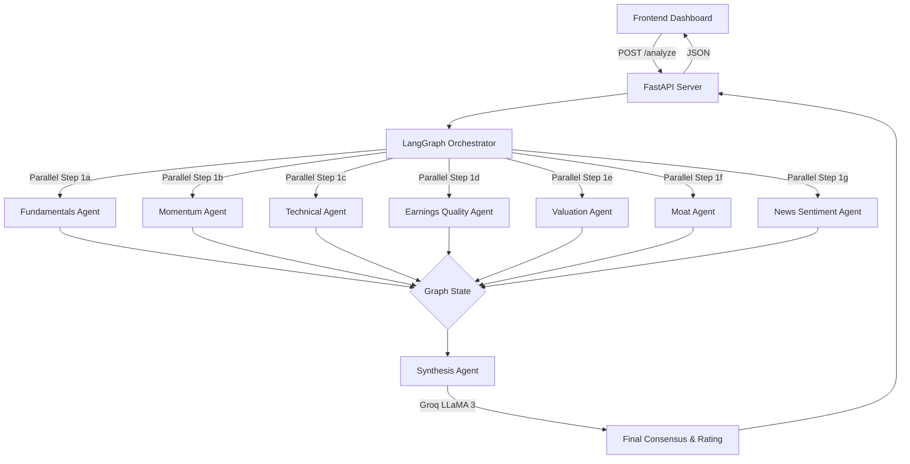

# Fin-Vantage Scout: Multi-Agent Equity Screener


## TL;DR

**Fin-Vantage Scout** is a Python-based, multi-agent AI system (LangGraph + FastAPI) that automatically screens stocks. It uses deterministic APIs (yfinance, Alpha Vantage) to fetch raw financial data and momentum metrics, then passes this hard data to an LLM (LLaMA 3) to generate accurate, hallucination-free investment summaries and ratings.

## Description

When you enter a list of stock tickers (or run in Auto mode), Fin-Vantage Scout performs a structured analysis of each stock step-by-step:

1. **Information Gathering (Parallel Agents):** The system triggers seven independent analysis specialists in parallel:
   - **Fundamentals:** Collects core balance sheet health (Current Ratio, Debt-to-Equity) and profitability metrics (ROE, Gross Margin, and quarterly growth rates).
   - **Momentum:** Evaluates price performance over the last 6 and 12 months, calculating how the stock ranks compared to its peers, along with speed/momentum indicators.
   - **Technicals:** Examines volume spikes relative to historical averages, price drawdown from yearly highs, volatility, and trading accumulation trends.
   - **Earnings Quality:** Assesses the cash backing behind reported earnings, validating if profits are real cash flows or just accounting accruals.
   - **Valuation:** Measures standard pricing multiples (P/E, P/S, EV/EBITDA) against median valuation levels of same-sector peers in the analysis batch.
   - **Moat Durability:** Computes consistency and stability of profit margins, return on capital, and sales growth over several years.
   - **News Sentiment:** Scrapes the latest financial headlines and uses a fast language classifier to assess news sentiment.
2. **Deterministic Composite Scoring:** Before involving any reasoning models, the system mathematically calculates a composite score (1–99) representing the quantitative strength of the stock based on its momentum, earnings growth, and gross margins.
3. **AI Synthesis & Recommendation:** The qualitative and quantitative results from all 7 specialists are packaged and passed to a senior AI Analyst. This analyst verifies the inputs, writes a concise synthesis summary, assigns a final rating (Attractive, Neutral, or Caution), and comments on key aspects.
4. **Interactive Visualization:** The web dashboard updates dynamically, showing full-width stock cards, visual indicators for volume-momentum confirmation, interactive technical charts (price/volume, margins, peer valuation), and expandable detailed data sheets.

---

## Why

Traditional financial screeners rely on rigid rules and lack qualitative context, while raw LLMs hallucinate numbers and struggle with live data. Fin-Vantage Scout bridges this gap by enforcing a **"data-first, LLM-second"** architecture. It hardcodes the mathematical and fundamental data gathering step, passing perfectly structured context to an LLM strictly for qualitative synthesis and sentiment analysis. 

---

## What's New (Phase 3 & Phase 4 Updates)

- **Sequential Pipeline Reordering (News shifted to 1g):** Reordered the multi-agent graph so that *News Sentiment* acts as the final qualitative "soft signal" (Step 1g) in the parallel fan-out, fanning into Step 2 (Synthesis) alongside the 6 quantitative data specialists.
- **ApexCharts-Powered Peer Comparison & Technical Charts:** Replaced legacy visualizations with fully responsive, interactive interactive charts in the UI. Users can dropdown-switch between Price/Volume, Momentum Percentiles, Margin & ROIC Trends, and Batch-scoped Peer Valuations.
- **Advanced Quantitative Metrics (Sloan Accruals & Moat CoV):** Integrated Sloan Accruals (earnings quality) and Coefficient of Variation (CoV) calculations for Moat Durability.
- **Deterministic 1–99 Composite Score:** Implemented a non-LLM, deterministic grading system combining Momentum, EPS growth, and Gross Margins.
- **Improved UI Layout with Integrated Summaries:** Redesigned the stock cards to feature the AI Synthesis summary prominently at the top, followed by quick reference tiles, and collapsible detailed metric sheets.
- **Favicon & Cache Buster Integrations:** Silenced browser 404s for favicon resources and implemented query-string cache-busters (`?v=3`) to ensure instant frontend deliveries of fresh stylesheets and JS updates.

---

## Stock Selection Modes

1. **Manual Ticker Entry:** Input specific comma-separated tickers (e.g., `NVDA, MSFT, AAPL`) to run targeted analysis.
2. **Auto (FFTY Screen):** Scrapes the Innovator IBD 50 ETF (FFTY) holdings to dynamically extract and analyze top-tier momentum and growth stocks.

---

## Methodologies & Formulas

The platform algorithmically assesses stocks using the following mathematical formulas before passing structured data to the LLM for qualitative synthesis:

### 1. Current Ratio
- **Formula:** `Current Assets / Current Liabilities`
- **Definition:** Measures short-term liquidity and ability to cover near-term obligations.

### 2. Debt-to-Equity Ratio (D/E)
- **Formula:** `Total Debt / Shareholders' Equity`
- **Definition:** Evaluates financial leverage and capital structure safety.

### 3. Return on Equity (ROE)
- **Formula:** `Net Income / Shareholders' Equity`
- **Definition:** Gauges profitability efficiency in using shareholder capital.

### 4. Gross Margin
- **Formula:** `(Total Revenue - Cost of Goods Sold) / Total Revenue`
- **Definition:** Core profitability ratio indicating margin power.

### 5. Momentum Percentile Rank (6M & 12M)
- **Formula:** `(Number of Tickers with Lower Return / Total Tickers in Universe) * 100`
- **Definition:** Relative return strength ranking against peer tickers (e.g. FFTY components).

### 6. Volume vs 50d Average
- **Formula:** `(Current Volume - 50-Day Avg Volume) / 50-Day Avg Volume`
- **Definition:** Measures volume intensity to confirm if buying or selling momentum is backed by high institutional volume.

### 7. Relative Strength Index (RSI - 14 Day)
- **Formula:** `100 - (100 / (1 + (Average Gain / Average Loss)))`
- **Definition:** Momentum oscillator identifying overbought (>70) or oversold (<30) conditions.

### 8. Sloan Accruals Ratio
- **Formula:** `(Net Income - Operating Cash Flow) / Total Assets`
- **Definition:** Measures earnings quality. Ratios > 0.1 indicate non-cash accruals (lower quality), while ratios < 0 indicate high-quality earnings backed by real cash flow.

### 9. Cash Conversion Ratio
- **Formula:** `Operating Cash Flow / Net Income`
- **Definition:** Checks if net income translates efficiently to usable cash flow. Ideally >= 1.0.

### 10. Peer Median P/E Valuation
- **Formula:** `Median(Trailing P/E of all batch tickers in same sector)`
- **Definition:** Measures relative valuation pricing vs local sector peers.

### 11. Moat Durability (Coefficient of Variation - CoV)
- **Formula:** `Standard Deviation / Mean`
- **Definition:** Calculated for Gross Margin, ROIC (Net Income / Total Assets proxy), and YoY Revenue Growth. Lower CoV indicates consistent performance and a wider business moat.

### 12. Blended Composite Score
- **Formula:** `(0.40 * Avg Momentum Percentile) + (0.35 * Scaled EPS Growth) + (0.25 * Scaled Gross Margin)`
- **Definition:** A 1-99 score where higher numbers represent premium growth, margin, and momentum metrics.

---

## File Structure

```text
fin-vantage-scout/
├── backend/
│   ├── agents/
│   │   ├── step1a_fundamentals_agent.py   # Balance sheet health and profitability metrics
│   │   ├── step1b_momentum_agent.py       # Relative strength calculations (6m/12m returns)
│   │   ├── step1c_technical_agent.py      # Volume intensity, RSI, Acc/Dis, and ATR indicators
│   │   ├── step1d_earnings_quality_agent.py# Sloan accruals and cash conversion calculations
│   │   ├── step1e_valuation_agent.py      # Peer-relative multiples & peer median benchmarking
│   │   ├── step1f_moat_agent.py           # Margin stability and ROIC CoV calculations
│   │   ├── step1g_news_agent.py           # Headline scraper & sentiment classifier (final node)
│   │   └── step2_synthesis_agent.py       # Main consensus aggregator & investment case writer
│   ├── data/
│   │   ├── alpha_vantage.py               # REST API client for Alpha Vantage (Technicals, RSI)
│   │   └── market_data.py                 # SQLite-cached yfinance SDK wrapper
│   └── app.py                             # FastAPI server & LangGraph pipeline compiler
├── frontend/
│   ├── static/
│   │   ├── app.js                         # Dynamic rendering engine & client interactions
│   │   └── style.css                      # Custom dark-theme styling design system
│   └── templates/
│       └── index.html                     # Responsive single-page application template
├── config.py                              # Environment variables and configuration
├── requirements.txt                       # Backend dependency manifest
└── README.md                              # Project documentation
```

---

## Detailed Tech Stack Table

| Component | Technology | Purpose |
|---|---|---|
| **Language** | Python 3.11 | Core backend execution and scripting. |
| **Framework** | FastAPI | High-performance async web server providing REST endpoints. |
| **Agent Orchestration** | LangGraph | State-machine graph logic to parallelize agents and enforce workflow structure. |
| **LLM Inference** | LLaMA 3 (via Groq/Ollama) | Fast, cheap LLM for qualitative sentiment parsing and final synthesis. |
| **Market Data (Primary)** | `yfinance` | Primary source for price history, financials, and peer-universe tracking. |
| **Market Data (Secondary)** | Alpha Vantage | Fallback for missing fundamentals and source for 14-day RSI technicals. |
| **News Data** | `duckduckgo_search` | Headless scraping of recent financial headlines. |
| **Caching** | SQLite | Local disk caching with TTL to prevent rate-limiting from data providers. |
| **Frontend** | Vanilla JS / HTML / CSS | Lightweight, custom dashboard without heavy React/Vue build steps. |

---

## Detailed Architecture Diagram



---

## Setup Instructions

### Prerequisites
- Python 3.11+
- `uv` package manager (recommended) or `pip`

### 1. Clone & Install
```bash
git clone https://github.com/jayantsom/fin-vantage-scout.git
cd fin-vantage-scout
uv venv
source .venv/bin/activate  # (Windows: .venv\Scripts\activate)
uv pip install -r requirements.txt
```

### 2. Configure Environment
Create a `.env` file in the root directory (refer to `.env.example`):
```env
# Required for News and Synthesis Agent (Free Tier Available)
GROQ_API_KEY="gsk_..."

# Optional but Highly Recommended for Fallbacks & RSI (Free Tier Available)
ALPHA_VANTAGE_API_KEY="your_alpha_vantage_key"

# Uses cloud Groq API by default
LLM_PROVIDER="groq" 
```

### 3. Run the Server
```bash
uv run uvicorn backend.app:app --host 127.0.0.1 --port 8000 --reload
```
Access the dashboard at `http://127.0.0.1:8000`.

---

## Validations

- **Structured Output Parsing:** LangChain structured parser validates JSON structures directly from LLaMA 3 to prevent formatting schema errors.
- **Robust Degradation:** Fallbacks to Alpha Vantage for fundamentals and graceful handling of throttled API endpoints keep calculations active even on API threshold breaches.
- **Caching Speedups:** SQLite cache reduces successive call times for identical tickers to milliseconds, saving API limits.

---

## Future Scope

- **Advanced Valuation Modeler:** Integrating DCF (Discounted Cash Flow) and multi-comparable valuation valuations.
- **RAG-based Transcripts Reader:** Parsing forward guidance using transcripts from quarterly earnings calls.
- **Portfolio Construction optimizer:** Building optimal weight allocations based on screener signals.

---

## License & Intended Use

**MIT License**
This software is provided for educational and research purposes only. It does not constitute investment or financial advice. The developers are not liable for any financial losses incurred from using this tool.

---

## Author & Contact

**Jayant Som**
- **LinkedIn:** [https://www.linkedin.com/in/jayantsom](https://www.linkedin.com/in/jayantsom)
- **Email:** [jayant4195@gmail.com](mailto:jayant4195@gmail.com)
